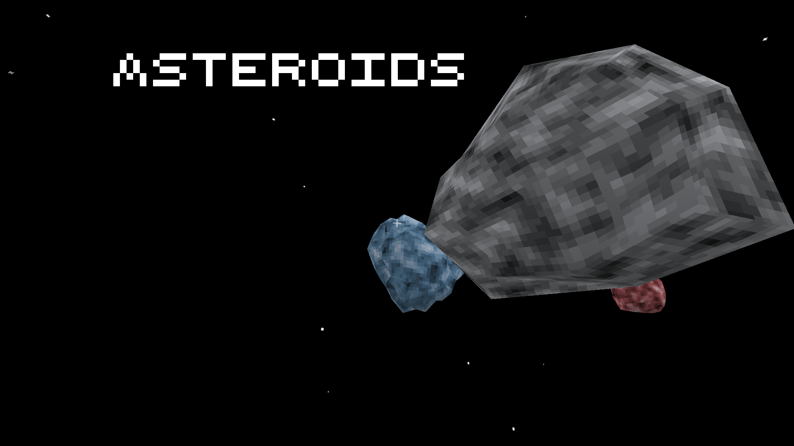

# Asteroids Game for Luanti

## Description

An attempt at making an Asteroids game for [Luanti]. It is working enough to be considered a
proof-of-concept. But it's very buggy.

Video demo: https://youtu.be/8d2IdKHrvcE

## Gameplay

_singleplayer only_

__Controls:__

- mouse: change facing direction
- W: move forward in facing direction
- left/right mouse button: fire

__Objective:__ Destroy asteroids to score points while avoiding being hit.

## Licensing

__Code:__ [MIT](LICENSE.txt)

__Textures:__

So far everything here is [CC0]. But more textures will be added in the future.

__Sounds:__

- menu theme
    - [CC0]
    - author: ColinSc
    - [link](https://freesound.org/s/546762/)
- asteroids_hit
    - [CC0]
    - author: ColinSc
    - [link](https://freesound.org/s/546762/)
- asteroids_ship_engine
    - [CC0]
    - author: theMinesAreShakin
    - [link](https://opengameart.org/node/170392)
- asteroids_ship_explosion
    - [CC0]
    - author: Rick Hoppmann (TinyWorlds)
    - [link](https://opengameart.org/node/33778)
- asteroids_ship_shoot
    - [CC BY 3.0]
    - author: dklon
    - [link](https://opengameart.org/node/6882)

## Links

- [ContentDB](https://content.luanti.org/packages/AntumDeluge/asteroids/)
- [Forum](https://forum.luanti.org/viewtopic.php?t=32557)
- Git Mirrors:
    - [Codeberg](https://codeberg.org/AntumLuanti/game-asteroids)
    - [GitHub](https://github.com/AntumLuanti/game-asteroids)
    - [GitLab](https://gitlab.com/AntumLuanti/game-asteroids)
- [Changelog](changelog.txt)
- [TODO](TODO.txt)

[Luanti]: https://www.luanti.org/

[CC BY 3.0]: https://creativecommons.org/licenses/by/3.0/
[CC0]: https://creativecommons.org/publicdomain/zero/1.0/
